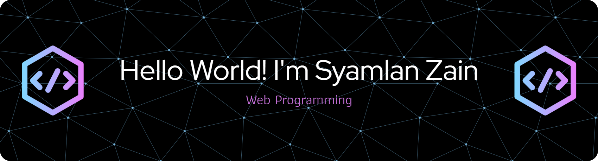

<!-- ### Hello World! I'm Syamlan Zain 👋 -->
<!-- **Zainsyam/Zainsyam** is a ✨ _special_ ✨ repository because its `README.md` (this file) appears on your GitHub profile.  Here are some ideas to get you started:  - 🔭 I’m currently working on ... - 🌱 I’m currently learning ... - 👯 I’m looking to collaborate on ... - 🤔 I’m looking for help with ... - 💬 Ask me about ... - 📫 How to reach me: ... - 😄 Pronouns: ... - ⚡ Fun fact: ...-->

##### 🎓 About Me
- engineering in information technology Students of **Annuqayah University**
- Junior **Web Developer**
- Freelancer 
- Currently mastering Full Stack Web Development

##### 💻 Tech Stack:

                             

##### 📊 GitHub Stats:

 
 

##### 🏆 GitHub Trophies

##### ✍️ Random Dev Quote

##### 🔝 Top Contributed Repo

---

<!-- Proudly created with GPRM ( https://gprm.itsvg.in ) -->

##### 🔝 Top Contributed Repo

---

##### Connact With Me

 
<!--  -->

<!-- Proudly created with GPRM ( https://gprm.itsvg.in ) -->
